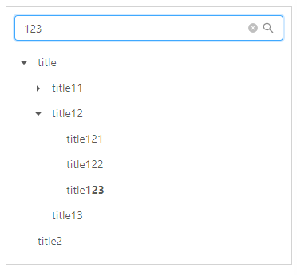
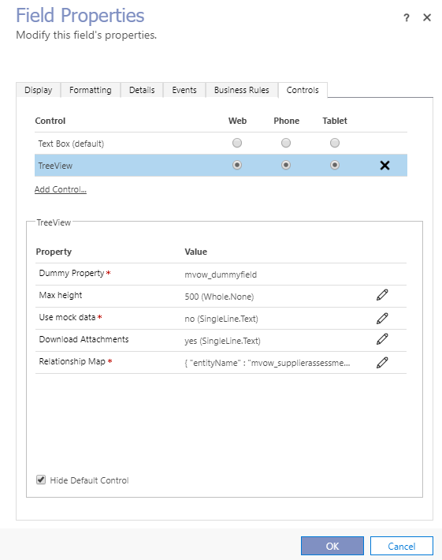

This repository contains the PCF controls developed by Delegate. We will put focus on PCF, so stay tuned by following the repo.

# Year Picker
This control is bound to a Date-only field. The purpose is to make it easier to only pick a year from a date field. The input field is a number field, so a num-pad appears on mobile.
The control is styled to match the input fields on a Model-driven app.


Also matches the hover effects


# TreeView
The tree view can be used to visualize a record and it's children (in a 1-N relationship). It has special support for attachments/annotations, enabling you to open or download the attachments with at double click.



## Adding it to the form
To add the component to a form, simply add a field with the type `SingleLine.TextArea`. Then find the field properties and locate the final tab, called "Controls".
Here, you can add the TreeView control, and enable it for all devices. Marking it will reveal all the parameters (properties) you can set for the component. Here is a rundown:


| **PROPERTY** | **DESCRIPTION** |
|--|--|
| **Dummy Property** | Simply the field it bounds to on the form. You can leave this empty, it is simply used to get the context and use the webapi. |
| **Max height** | Leave empty to allow the component to expand, or enter a positive number, that sets a maximum height in pixels. |
| **Use mock data** | Used for testing, fills the tree with fake data that can't be clicked. Write `yes` to allow fake data. |
| **Download Attachments** | Double clicking an attachment/image will by default open the image or PDF in a new tab. If you wish to download the picture instead, write `yes` here. |
| **Relationship Map** | A JSON string that defines the relationship from the root entity and the children the tree view should display. |



### The relationship map
This input is needed for the component to know what records to fetch, with everything it needs for the query. If you don't know JSON, have a read on [https://en.wikipedia.org/wiki/JSON]().

A Relationship map could look like this:
```json
{
    "entityName" : "mvow_supplierassessment",
    "titleField" : "mvow_name",
    "children": [
        {
           "entityName" : "mvow_assessment_question",
           "titleField" : "mvow_name",
           "parentLinkField" : "mvow_AssessmentLink",
	   "children": [
        	{
          	 "entityName" : "annotation",
         	 "titleField" : "filename",
          	 "parentLinkField" : "_objectid_value"
        	}
            ]
        }
    ]
}
```

Every object (defined with {}) has the following attributes:

| **ATTRIBUTE** | **DESCRIPTION** |
|--|--|
| entityName | The schema name of the entity to search for. |
| titleField | Schema name of the field on the entity that should be used as the label in the tree. |
| parentLinkField | _Optional_ - Needed on all children. Is used to find the records related to the parent. |
| children | _Optional_ A list of more relationship map objects. This is what defines what children will be shown in the tree view. |

You can find schema names in any solution in the system.

#### The Microsoft bug
Even though the type of the relationship supports many characters, the actual input field for the parameter has a cap of 100. This is only set client-side and can be changed in the DOM. **You need to do this every time you change the relationship map**. 
How to do it can be seen in the following video:

